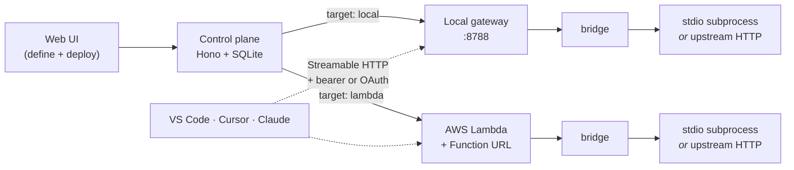

# rmcp

**Turn any MCP server into a remote HTTPS endpoint your AI clients can reach.**

Most MCP servers are npm packages that run as a local subprocess over stdio.
That works on one machine, for one client. The moment you want the same server
in Claude Desktop *and* VS Code *and* on your phone, you need it to be a remote
server speaking Streamable HTTP — with TLS, authentication, and somewhere to
keep the API keys.

rmcp is the small control plane that does that. You paste an mcp.json-style
definition into a web UI, click Deploy, and get back a URL and a config snippet
for your client. It handles the packaging, the credentials, and the transport.



## What you get

**Two server types.** A **stdio** server is any npm-published MCP server — the
kind you'd normally run with `npx`. rmcp installs it and runs it behind a
Streamable HTTP bridge. An **http** server is one that's already remote; rmcp
proxies it and injects the auth headers server-side, so your clients never hold
the upstream credential.

**Two deploy targets**, chosen per server at deploy time:

| | **local** | **lambda** |
|---|---|---|
| Runs on | your machine or your own box | AWS Lambda behind a Function URL |
| Reachable at | `http://<host>:8788/<id>` (LAN), or a public HTTPS URL if you front it with a reverse proxy | the Function URL |
| Auth | bearer token **or** OAuth | bearer token |
| Needs AWS | no | yes |
| Cold start | none — kept warm while rmcp runs | yes |
| Secrets live in | local SQLite | SSM Parameter Store |

A fully local flow needs no AWS account at all.

**Client snippets, generated.** Every deployed server has an Export view with
ready-to-paste config for VS Code, Cursor, the Claude CLI, Claude Desktop, and
Notion custom agents — with the right auth already filled in.

## Prerequisites

- Node >= 22 and pnpm (`corepack enable`)
- macOS or Linux
- **Only for the Lambda target:** AWS credentials in `~/.aws`, with permissions
  for Lambda, IAM (role creation), SSM Parameter Store, and S3 (packages over
  45 MB are staged through an `rmcp-deploy-<account>-<region>` bucket).

## Quickstart

```bash
pnpm install
pnpm --filter @rmcp/bridge build   # bundle the bridge — required before first run
pnpm dev                           # API on :8787, UI on :5173
```

Open <http://localhost:5173>.

1. **Create a server.** Give it a name (`[a-z0-9-]`, up to 40 chars) and either
   an npm package + version (stdio) or an upstream URL (http). Declare each env
   var or header, marking the sensitive ones as `secret`.
2. **Set the secrets** on the server's page. Values go into rmcp's local SQLite
   database, and are pushed to SSM Parameter Store only when you deploy to
   Lambda.
3. **Deploy** — locally or to Lambda. Either way rmcp finishes by running a real
   MCP `initialize` handshake against the new endpoint, so a green deploy means
   the server actually answered.
4. **Connect** — open Export and copy the snippet for your client.

Undeploy removes the compute but keeps your secrets. Deleting a server purges
its secrets, and for servers with an AWS footprint, everything under
`/rmcp/<id>/` in SSM.

## Connecting a client

**VS Code** — merge into `.vscode/mcp.json`:

```json
{ "servers": { "my-server": { "type": "http", "url": "https://…/<id>",
  "headers": { "Authorization": "Bearer <token>" } } } }
```

**Claude CLI** — one command:

```bash
claude mcp add --transport http my-server https://…/<id> \
  --header "Authorization: Bearer <token>"
```

**Claude Desktop** — depends on the target. Local servers front an OAuth
authorization server that Claude Desktop speaks natively: add a custom
connector, paste the client ID and secret from the Export view, and click
Connect. A browser tab opens and closes by itself — there's nothing to approve.
Lambda servers have no authorization server, so they go through the `mcp-remote`
stdio bridge instead (the Export view generates that config too).

**Cursor** and **Notion custom agents** are also covered in the Export view.

## Endpoints and auth

Endpoints are keyed by the server's UUID, not its name — renaming a server never
changes its URL. Every endpoint is protected by a per-server bearer token,
enforced identically on both targets. Local endpoints additionally accept OAuth
access tokens, which resolve to the same bearer internally.

The local gateway listens on all interfaces, so other devices on your LAN can
reach it. To expose it to the internet, put a reverse proxy in front — see
[self-hosting](docs/self-hosting.md), which covers exactly that with Caddy and
automatic TLS.

## Documentation

- **[Architecture](docs/architecture.md)** — how the control plane, gateway,
  bridge, and deployer fit together, and what a request actually does.
- **[Security model](docs/security.md)** — authentication, the OAuth server,
  where secrets live, and what this tool explicitly does not defend against.
- **[Configuration](docs/configuration.md)** — settings, environment variables,
  and the HTTP API.
- **[Self-hosting](docs/self-hosting.md)** — running it on a Linux box behind
  Caddy with public HTTPS endpoints.

## Development

```
apps/api          control plane (Hono), local gateway, OAuth server
apps/web          React + Vite UI
packages/bridge   Streamable HTTP → stdio / http-proxy; runs in Lambda and in-process
packages/deployer AWS pipeline: stage, zip, IAM role, SSM params, function, healthcheck
packages/shared   zod schemas shared across the workspace
```

```bash
pnpm test        # vitest across the workspace
pnpm typecheck   # tsc --noEmit across the workspace
pnpm e2e         # end-to-end deploy against real AWS (needs credentials)
```

The bridge is the piece worth understanding first: the same `makeHandler` runs
inside the Lambda and in-process behind the local gateway, which is why both
targets behave identically down to the auth check.

## License

MIT — see [LICENSE](LICENSE).
