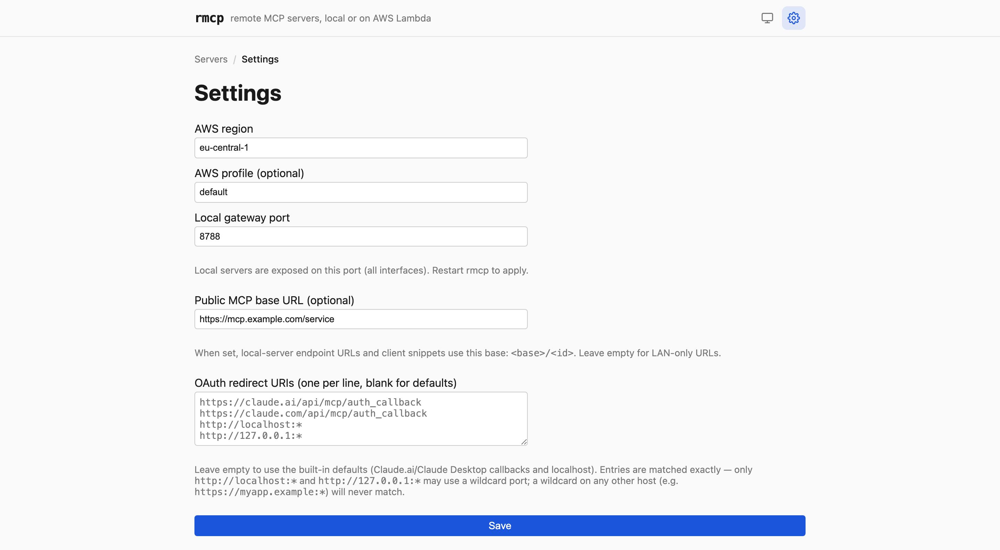

# Configuration

## Settings

Edited in the UI under **Settings**, stored as a single JSON row in the SQLite
`settings` table, and readable at `GET /api/settings`.



| Key | Default | What it does |
|---|---|---|
| `region` | `us-east-1` | AWS region for every Lambda-target operation. |
| `profile` | *(none)* | Named profile from `~/.aws/credentials`. Unset uses the default credential chain (env vars, SSO, instance role). |
| `localGatewayPort` | `8788` | Port the local MCP gateway listens on, across all interfaces. |
| `publicMcpBaseUrl` | *(none)* | Public base URL local endpoints are reachable at, e.g. `https://mcp.example.com/service`. |
| `oauthRedirectUris` | see below | Allowlist of OAuth redirect URIs. |

### `publicMcpBaseUrl`

This does two things.

It changes how endpoints are **displayed**: local servers render their URL from
current settings rather than from what was stored at deploy time, so changing
this updates every server's snippet at once, with no redeploy. Lambda endpoints
are stored Function URLs and are never rewritten.

It also **enables OAuth**. The issuer is the origin of this URL — set it to
`https://mcp.example.com/service` and the issuer becomes
`https://mcp.example.com`. Until it is set, every OAuth endpoint returns `503`
rather than advertise a LAN address as an issuer.

Leave it empty for a purely local setup; endpoints then render as
`http://<hostname>.local:<port>/<id>`.

### `oauthRedirectUris`

When unset, the default list is:

```
https://claude.ai/api/mcp/auth_callback
https://claude.com/api/mcp/auth_callback
http://localhost:*
http://127.0.0.1:*
```

Matching is exact, except that the two loopback entries match any port and path
— desktop clients pick their callback port at runtime. The wildcard applies only
to those two literal hosts over plain HTTP. Setting a non-empty list replaces
the defaults entirely.

## Environment variables

**Control plane:**

| Variable | Default | Effect |
|---|---|---|
| `RMCP_API_PORT` | `8787` | Port for the REST API. Always bound to `127.0.0.1`. |
| `RMCP_DB_PATH` | `apps/api/data/rmcp.db` | SQLite database path. Local staging goes in `local/` next to it. |

The default database path is resolved relative to the API module, not the
working directory, so launching from anywhere reaches the same file.

**Bridge** (mostly set for you; useful when debugging):

| Variable | Set by | Effect |
|---|---|---|
| `RMCP_SERVER_ID` | the deployer, as a Lambda env var | Which `/rmcp/<id>/` prefix to load runtime config from. |
| `RMCP_TASK_ROOT` | — | Fallback root the staged binary path resolves against, for debugging. Local deploys pass this in-process instead. Defaults to `/var/task` (Lambda). |
| `RMCP_CHILD_CWD` | — | Working directory for the stdio child. Defaults to `/tmp`. |
| `RMCP_TEST_CONFIG` | tests | Inline runtime JSON, bypassing SSM entirely. |

## Ports

| Port | Bind | Service |
|---|---|---|
| 8787 | `127.0.0.1` | Control plane REST API |
| 8788 | `0.0.0.0` | Local MCP gateway (configurable) |
| 5173 | `localhost` | Vite dev server, proxying `/api` to 8787 |

Changing `localGatewayPort` does not rebind a running gateway — restart rmcp to
apply it.

## AWS permissions

Only needed for the Lambda target. The credentials rmcp runs with need:

- **Lambda** — create/update/delete functions, function URL configs, and
  `AddPermission` on the resource policy
- **IAM** — `GetRole`, `CreateRole`, `PutRolePolicy` for the shared
  `rmcp-lambda-role`
- **SSM Parameter Store** — put/get/delete and tag parameters under `/rmcp/*`
- **S3** — head/create bucket, put/delete object, for packages over 45 MB staged
  through `rmcp-deploy-<account>-<region>`

The Lambda execution role rmcp creates is much narrower: CloudWatch Logs, plus
read access to `arn:aws:ssm:*:*:parameter/rmcp/*`.

## HTTP API

Base `http://127.0.0.1:8787`. No authentication — see
[security](security.md#what-is-protected-and-what-isnt).

### Servers

| Method | Path | Notes |
|---|---|---|
| `GET` | `/api/servers` | All servers, ordered by sort index then name. |
| `POST` | `/api/servers` | `{name, config, folder?}` → `201`. `409` if the name is taken. |
| `GET` | `/api/servers/:id` | |
| `PUT` | `/api/servers/:id` | `{name?, config?, folder?}`. `409` when renaming a Lambda-deployed server. |
| `DELETE` | `/api/servers/:id` | `409` unless undeployed. Purges secrets and SSM parameters. |
| `PUT` | `/api/servers/order` | `{ids: [...]}` — must list every server exactly once. |

`name` must match `^[a-z0-9-]{1,40}$`. `config` is a discriminated union on
`type`:

```jsonc
// stdio
{ "type": "stdio", "package": "@scope/pkg", "version": "latest",
  "args": ["--flag"],
  "env": { "PLAIN": {"kind":"plain","value":"x"},
           "API_KEY": {"kind":"secret","set":false} } }

// http
{ "type": "http", "url": "https://upstream.example.com/mcp",
  "headers": { "Authorization": {"kind":"secret","set":false} } }
```

### Deployment

| Method | Path | Notes |
|---|---|---|
| `POST` | `/api/servers/:id/deploy` | `{target: "local" \| "lambda"}` → `202 {attempt}`. `409` if one is in flight. |
| `POST` | `/api/servers/:id/undeploy` | Removes compute, keeps secrets. |
| `GET` | `/api/servers/:id/logs` | Step events for the **latest** attempt only. |
| `GET` | `/api/servers/:id/export` | Client snippets. `400` unless deployed. |

Deploys are asynchronous: the `202` means accepted, not finished. Poll the
server record until `status` leaves `deploying`, and read `logs` for progress.

Statuses: `draft` → `deploying` → `deployed` | `error`, plus `undeployed`.

### Secrets

| Method | Path | Notes |
|---|---|---|
| `PUT` | `/api/servers/:id/secrets/:key` | `{value}`. The key must already be declared `secret` in the config. |
| `DELETE` | `/api/servers/:id/secrets/:key` | Also deletes from SSM if the server has an AWS footprint. |

Secret values are never returned by any endpoint.

### OAuth and maintenance

| Method | Path | Notes |
|---|---|---|
| `POST` | `/api/servers/:id/oauth/regenerate` | Local target only. Mints new credentials, revokes all grants. `409` during a deploy. |
| `GET` | `/api/orphans` | Lambda functions tagged `rmcp:server-id` whose server is gone from this database. |
| `POST` | `/api/orphans/cleanup` | `{items: [{functionName, serverId}]}` — deletes the functions and their SSM parameters. |
| `GET`/`PUT` | `/api/settings` | |

Orphans happen when a database is restored from a backup, or when rmcp is moved
between machines while Lambda functions are still live.

## Gateway endpoints

Served on the gateway port, not the API port.

| Method | Path | Notes |
|---|---|---|
| `POST` | `/:id` | The MCP endpoint. Bearer token or OAuth access token required. |
| `DELETE` | `/:id` | Ends an upstream session (http-proxy servers). |
| `GET` | `/.well-known/oauth-authorization-server` | `503` until `publicMcpBaseUrl` is set. |
| `GET` | `/.well-known/oauth-protected-resource/<path>` | `404` for servers with no OAuth credentials. |
| `GET` | `/oauth/authorize` | |
| `POST` | `/oauth/token` | `authorization_code` and `refresh_token` grants. |

A `401` from a server that has OAuth credentials carries a `WWW-Authenticate:
Bearer resource_metadata="…"` header pointing a spec-compliant client at
discovery.
