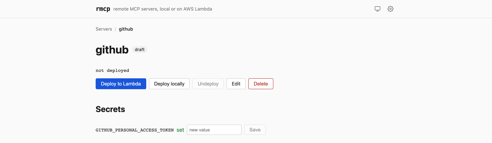

# Security model

rmcp is a **single-user tool**. It has no user accounts, no roles, and no
multi-tenancy. Everything below follows from that: the control plane trusts
whoever can reach it, and the security boundary is around the *endpoints* it
publishes, not around the UI.

Read this before exposing anything to the internet.

## What is protected, and what isn't

| Component | Binds to | Protection |
|---|---|---|
| Control plane API | `127.0.0.1:8787` | **None.** Loopback only. |
| Web UI (dev) | `localhost:5173` | **None.** |
| Local MCP gateway | `0.0.0.0:8788` | Per-server bearer token, or OAuth |
| Lambda Function URL | public | Per-server bearer token (`AuthType: NONE` at the AWS layer) |

The control plane deliberately binds to loopback and has no authentication of
its own. Anyone who can reach it can read every secret. If you run rmcp on a
shared or remote host, you must put authentication in front of it — see
[self-hosting](self-hosting.md), which does this with a LAN-bound vhost behind
HTTP Basic Auth on a port that is never forwarded.

## Endpoint authentication

Every server gets a bearer token at first deploy: 32 bytes from
`crypto.randomBytes`, base64url-encoded. It is **reused across redeploys** —
rotating it on every code change would silently break every configured client.

The check lives in the bridge, so it runs identically on both targets:

```ts
const a = createHash("sha256").update(presented).digest();
const b = createHash("sha256").update(expected).digest();
return timingSafeEqual(a, b);
```

Hashing before comparing keeps the comparison length-independent, so a mismatch
leaks nothing about the expected value — including its length.

Endpoints are additionally keyed by the server's UUID rather than its name.
Reaching a public endpoint requires **both** the unguessable path and the token.
That is defence in depth, not a substitute for the token.

**Lambda Function URLs are created with `AuthType: NONE`** and a resource policy
allowing `Principal: "*"`. AWS performs no authentication; the bridge's bearer
check is the only gate. This is intentional — SigV4 would make the endpoints
unusable from MCP clients — but it means a leaked token is enough to reach the
server, and the endpoint is publicly routable the moment it is deployed.

## OAuth authorization server

Local-target servers front a small OAuth 2.1 authorization server so Claude
Desktop and similar clients can connect natively, without the `mcp-remote` hop.
Lambda servers have none.

It implements the subset that MCP clients actually use:

- `GET /.well-known/oauth-authorization-server` — issuer metadata
- `GET /.well-known/oauth-protected-resource/<path>` — per-server resource metadata
- `GET /oauth/authorize` — authorization code
- `POST /oauth/token` — `authorization_code` and `refresh_token` grants

**Deliberate design decisions:**

**PKCE is mandatory, S256 only.** A missing or non-S256 `code_challenge` is
rejected. `plain` is not supported.

**Authorization is auto-approved — there is no consent screen.** For a
single-user tool where the operator is also the only resource owner, a consent
prompt asks you to approve yourself. The gate that matters is the client secret,
which only you can read from the Export view.

**No dynamic client registration.** Credentials are minted at deploy time and
shown in the UI. An unknown `client_id` gets `invalid_client` and stops there.

**Authorization codes are single-use by construction.** `takeAuthCode` reads and
deletes in one SQLite transaction, so a replayed code finds nothing even under
concurrent requests — rather than relying on a check-then-delete window. Codes
live 60 seconds.

**Refresh tokens rotate.** The presented token is deleted when it is redeemed.
Access tokens expire after one hour; refresh tokens do not expire, and are
revoked by regenerating the server's credentials.

**Redirect URIs are an allowlist**, exact-match, with one carefully bounded
exception: `http://localhost:*` and `http://127.0.0.1:*` match any port, because
desktop clients spin up a throwaway callback listener on an unpredictable port.
The wildcard never widens beyond those two literal hosts over plain HTTP. The
default list also contains Claude's two hosted callbacks; you can replace it
entirely in Settings.

Errors follow RFC 6749 §4.1.2.1: they are only redirected back to the client
once **both** `client_id` and `redirect_uri` are known-good. Otherwise they
render locally as JSON — redirecting to an unvalidated URI would be an open
redirect.

Client secrets are compared with the same SHA-256 + `timingSafeEqual` approach
as bearer tokens.

**Every OAuth endpoint returns `503` until `publicMcpBaseUrl` is set**, because
the issuer is derived from it. rmcp will not guess a host and advertise a LAN
address as an OAuth issuer.

A valid access token resolves internally to the server's static bearer, which
the bridge then checks as usual — one auth implementation, two ways in.

## Secrets at rest

**Locally: plaintext in SQLite.** Secret values live in the `secrets` table,
unencrypted. This is a deliberate choice for a single-user tool on a machine you
control — an encryption key would have to live next to the database to be usable
unattended, which buys very little. The consequences are real, though:

- The database file must be mode `600` and owned by the account rmcp runs as.
- **Never commit it.** `.gitignore` covers `*.db` and its `-wal` / `-shm`
  sidecars, which contain recently written rows and have leaked credentials in
  other projects.
- Back it up the way you'd back up a password file.

**On AWS: SSM Parameter Store.** Bearer tokens and secret values are written as
`SecureString` (KMS-encrypted with the account's default key); the bridge config,
which by construction contains no secrets, is a plain `String`. Everything is
tagged `rmcp:server-id` and namespaced under `/rmcp/<id>/`. The Lambda execution
role's inline policy grants read access to `arn:aws:ssm:*:*:parameter/rmcp/*`
and nothing else.

Secrets are separated from configuration throughout: a server's config records
that a secret *exists* (`{kind: "secret", set: true}`) but never its value, which
is why the API can return a full server record to the browser safely.



The UI reflects this: a secret is shown as **set** or not, and the input is
write-only. There is no path — API or interface — that reads a value back out.

## Secret lifecycle

| Action | Effect on secrets |
|---|---|
| Undeploy | Kept — both locally and in SSM |
| Delete a secret | Removed locally; removed from SSM if the server has an AWS footprint |
| Delete a server | Purged locally, and everything under `/rmcp/<id>/` in SSM |
| Regenerate OAuth credentials | Secrets untouched; all codes and tokens for that server revoked |

The `aws_footprint` flag exists precisely so a server that once deployed to
Lambda still gets its SSM parameters cleaned up after it moves to local.

## Threat model

**Defended against:**

- Someone who finds an endpoint URL but has no token
- Token guessing (256 bits of entropy, constant-time comparison)
- Authorization code replay and interception (single-use, 60 s, PKCE)
- Compromise of one server's credentials affecting another (tokens, OAuth
  clients, and SSM paths are all per-server)
- Upstream credentials leaking to clients (http-proxy injects them server-side;
  clients only ever hold the rmcp token)

**Explicitly not defended against:**

- Anyone with local access to the machine or the database file
- Anyone who can reach the control plane API — it is unauthenticated by design
- A malicious MCP server package. `npm install` runs lifecycle scripts, and a
  stdio server runs as a child of rmcp with your secrets in its environment.
  Vet what you deploy; the trust model is the same as running `npx` yourself.
- Denial of service. There is no rate limiting anywhere. Body-size limits are
  the reverse proxy's job — the self-hosting Caddyfile sets them per route.
- Auditing. Deploy steps are logged; endpoint access is not.

## If a token leaks

1. **Bearer token:** there is no rotate button — a redeploy deliberately reuses
   the existing token so configured clients keep working. To force a new one,
   stop rmcp and clear the column by hand:
   ```bash
   sqlite3 apps/api/data/rmcp.db \
     "UPDATE servers SET bearer_token = NULL WHERE name = '<name>';"
   ```
   then start rmcp and redeploy. Every client for that server needs the new
   token.
2. **OAuth client secret:** press **Regenerate** on the server's page. This
   mints new credentials and revokes every outstanding code and token. Any
   client connected via OAuth must be re-added.
3. **An upstream credential you gave to rmcp** (a Monday API key, a GitHub PAT):
   rotate it at the source. rmcp stored it, but the blast radius is that
   service's, not rmcp's.
